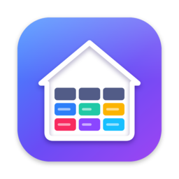
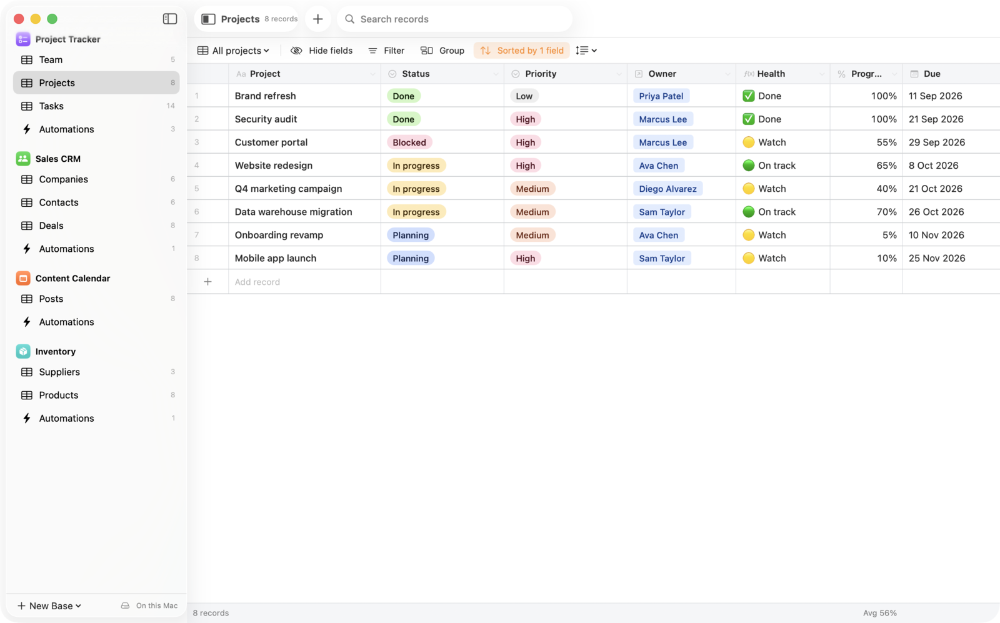
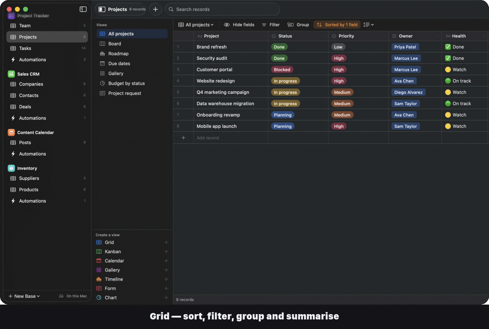
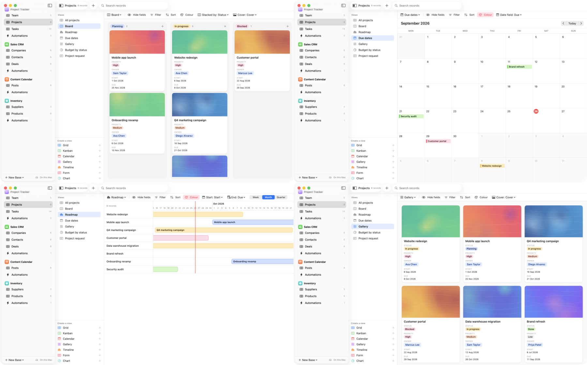
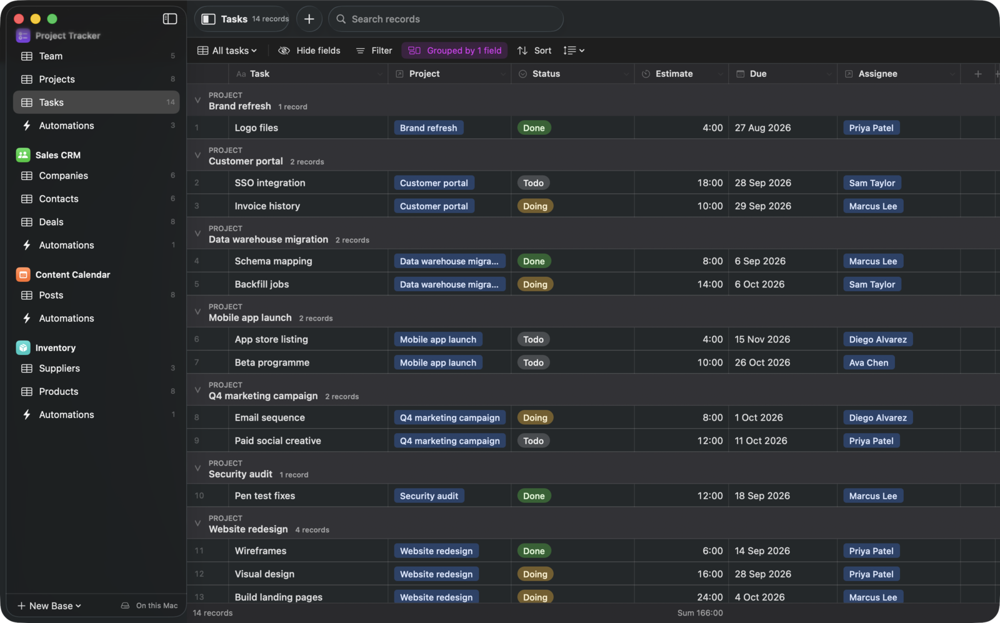
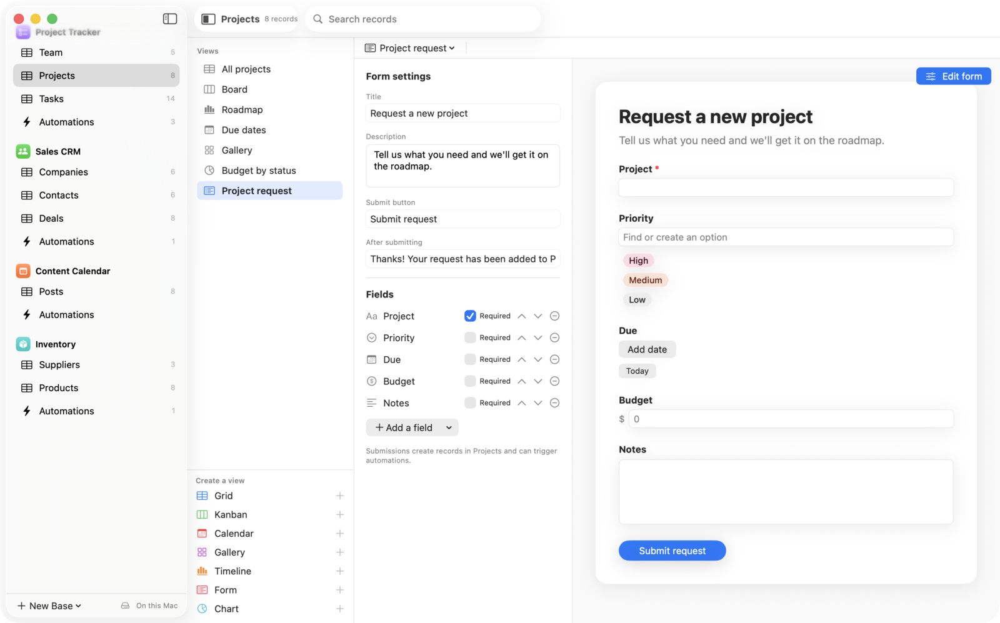
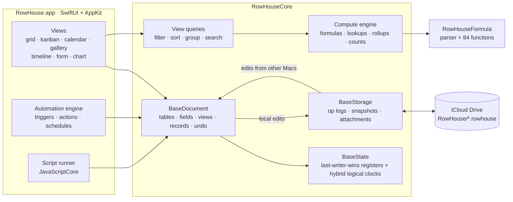
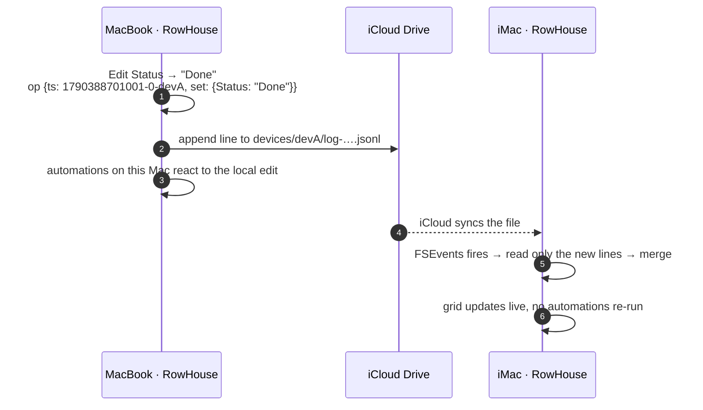
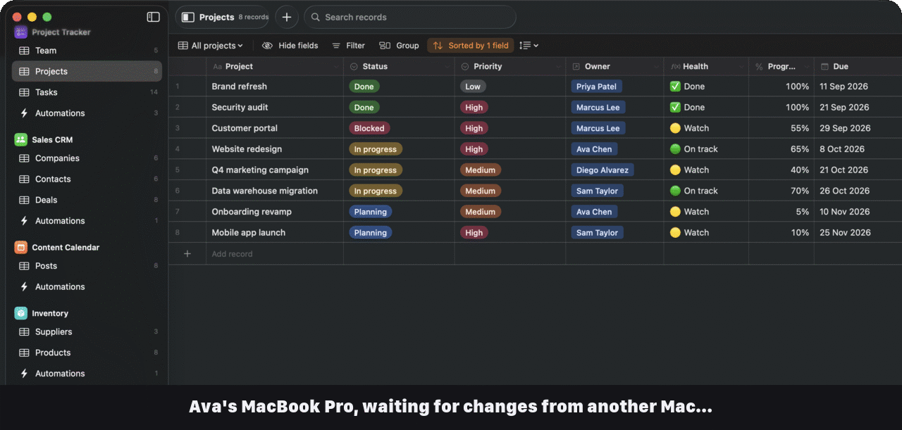
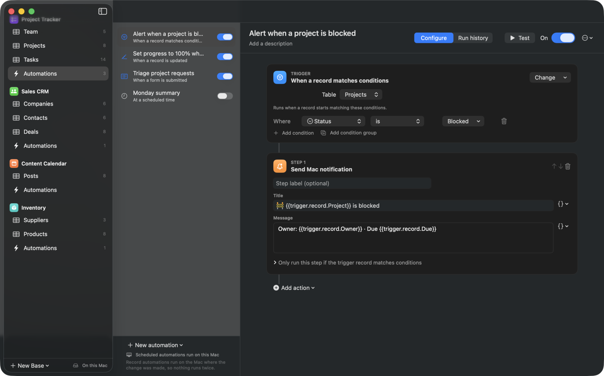

<p align="center">
  
</p>

<h1 align="center">RowHouse</h1>

<p align="center">
  <strong>A native Mac database with views, formulas and automations. Like Airtable, but your data lives in your own iCloud Drive.</strong>
</p>

<p align="center">
  <a href="https://github.com/REllwood/RowHouse/releases/latest"></a>
  <a href="https://github.com/REllwood/RowHouse/actions/workflows/ci.yml"></a>
  
  
  <a href="LICENSE"></a>
</p>

<p align="center">
  <a href="https://github.com/REllwood/RowHouse/releases/latest"><b>Download for Mac</b></a> ·
  <a href="https://rellwood.github.io/RowHouse/">Website</a> ·
  <a href="#how-it-works">How it works</a> ·
  <a href="#automations">Automations</a> ·
  <a href="#formulas">Formulas</a>
</p>

<picture>
  <source media="(prefers-color-scheme: dark)" srcset=".github/assets/hero-dark.png">
  
</picture>

RowHouse is a self-hosted, local-first alternative to Airtable for the Mac. You build bases out of tables, fields and linked records, and look at them as grids, kanban boards, calendars, galleries, timelines, forms and charts. Automations run when records change, when forms are submitted, when buttons are clicked or on a schedule.

There's no server and no account. Each base is a folder of plain files in **iCloud Drive › RowHouse**. Every Mac you use writes its own change log and merges the others, so your bases stay in sync, even when you edit on two Macs at once or while offline.

<p align="center">
  
</p>

## Contents

- [Features](#features)
- [Install](#install)
- [How it works](#how-it-works)
- [Automations](#automations)
- [Formulas](#formulas)
- [Keyboard shortcuts](#keyboard-shortcuts)
- [Importing and exporting](#importing-and-exporting)
- [Building from source](#building-from-source)
- [FAQ](#faq)

## Features

| | |
|---|---|
| **7 view types** | Grid, Kanban, Calendar, Gallery, Timeline, Form and Chart. Each view has its own filters, sorts, grouping, hidden fields, colours and column widths. |
| **24 field types** | Text, long text, email, URL, phone, number, currency, percent, duration, rating, checkbox, single and multiple select, date, attachment, link to another record, lookup, rollup, count, formula, created time, last modified time, autonumber and button. |
| **Linked records** | Two-way relationships between tables, with lookups, rollups and counts that update as you type. |
| **Formulas** | 84 Airtable-compatible functions for text, numbers, dates, arrays and regular expressions, with live validation and a built-in reference. |
| **Automations** | 7 triggers and 8 actions: create, update, delete and find records, Mac notifications, webhooks, JavaScript scripts and Apple Shortcuts. |
| **Spreadsheet feel** | Keyboard navigation, type-to-edit, range selection, copy and paste to and from Numbers or Excel, fill a range, undo and redo. |
| **Forms** | Build a form from any table. Submissions create records and can start automations. |
| **Comments** | A comment thread on every record, synced like everything else. |
| **Sync without a server** | Works in iCloud Drive, any synced folder, or on one Mac. Conflicts are resolved field by field, deterministically, on every device. |
| **Import** | CSV (with field type detection) and whole bases straight from Airtable using a personal access token. |
| **Templates** | Project Tracker, Sales CRM, Content Calendar and Inventory, each with sample data, views and working automations. |

<p align="center">
  
</p>

<p align="center">
  
  
</p>

## Install

1. Download **RowHouse-x.y.z.dmg** from the [latest release](https://github.com/REllwood/RowHouse/releases/latest).
2. Open it and drag **RowHouse** into **Applications**.
3. Open RowHouse and choose a template, or import a CSV or an Airtable base.

RowHouse needs **macOS 14 Sonoma or later** and runs natively on Apple silicon and Intel Macs. Releases are signed with a Developer ID. If macOS says it can't verify the app the first time you open it, go to **System Settings › Privacy & Security** and click **Open Anyway**.

To sync between Macs, turn on iCloud Drive on each one. RowHouse saves bases to **iCloud Drive › RowHouse** automatically. If you'd rather not use iCloud Drive, choose **On this Mac only** or any folder in **Settings › Storage**. A Dropbox or Syncthing folder works too.

## How it works

RowHouse is three Swift modules: a formula engine, a core library that has no UI, and the Mac app.



### Plain files, one writer each

A base is a folder you can see in Finder:

```
Project Tracker.rowhouse/
├── manifest.json                     written once, when the base is created
├── attachments/
│   └── 3f7a…c91e.jpg                 files, named by the SHA-256 of their contents
└── devices/
    ├── dev7f3a91c2e44b/              one folder per Mac, and only that Mac writes to it
    │   ├── log-1790388701001-8B5022.jsonl   append-only change log
    │   ├── snapshot.json             that Mac's merged state + the log segments it covers
    │   └── runs.jsonl                automation run history
    └── dev2b8c41d09e7a/
        └── …
```

Every edit becomes a small operation, `{ timestamp, entity, id, properties }`, that is appended to this Mac's log. Because each file has exactly one writer, iCloud Drive never has to resolve a conflict or create a "conflicted copy".

### Merging

Every property of every table, field, view, record and automation is a *last-writer-wins register* stamped with a [hybrid logical clock](https://cse.buffalo.edu/tech-reports/2014-04.pdf). An HLC is wall-clock time plus a counter plus the device id, so timestamps are unique and totally ordered even when Macs' clocks disagree. Merging is commutative, associative and idempotent. Any Mac that has seen the same set of operations ends up with identical state, no matter what order they arrived in or how many times.

- Two people editing different fields of the same record both keep their changes.
- Two people editing the same field: the later edit wins, the same way on every Mac.
- Deleting is a `_deleted` flag, so a delete and a concurrent edit resolve predictably.
- The inverse side of a link is computed from the owning side, so two-way links can never disagree.



<p align="center">
  
</p>

Each Mac also writes a snapshot of its merged state now and then. Opening a base loads the snapshots and replays only the log lines written after them, which keeps launch fast. Old log segments are deleted a day after a newer snapshot covers them. Files that "Optimise Mac Storage" has evicted are downloaded on demand.

### Automations run exactly once

With several Macs sharing a base, the same trigger must not fire on each of them:

- **Record triggers** (created, updated, matches conditions) fire only on the Mac where the change was made. Edits that arrive from another Mac are merged but never trigger anything.
- **Scheduled triggers** fire only on the base's *automation host*, the Mac chosen in **Settings › Automations**.
- Chains of automations stop after 5 levels, and each automation is limited to 60 runs a minute.

## Automations

<p align="center">
  
</p>

| Triggers | Actions |
|---|---|
| When a record is created | Create record |
| When a record is updated (optionally only for chosen fields) | Update record |
| When a record matches conditions | Delete record |
| When a form is submitted | Find records |
| At a scheduled time (every few minutes, hourly, daily, weekly, monthly) | Send Mac notification |
| When a button is clicked | Send HTTP request (webhooks, APIs) |
| When run manually | Run JavaScript |
| | Run an Apple Shortcut |

Any step can have its own conditions, such as "only if Status is Blocked". Every run is recorded with per-step results and logs, and you can see runs from all your Macs in **Run history**.

### Values from earlier steps

Text in any action can include placeholders:

| Placeholder | Value |
|---|---|
| `{{trigger.record.Name}}` | A field of the trigger record, by name |
| `{{trigger.record.id}}`, `{{trigger.record.url}}` | Record id and a `rowhouse://` link that opens it |
| `{{steps.2.count}}`, `{{steps.2.titles}}` | Output of step 2 (for example, Find records) |
| `{{steps.3.status}}`, `{{steps.3.json.id}}` | Status and parsed JSON from an HTTP request |
| `{{now}}`, `{{today}}` | Current date and time |

Add `| json` to insert a value safely inside a JSON body, or `| url` for a query string: `{"name": {{trigger.record.Name | json}}}`.

### Scripts

Scripts use a subset of Airtable's scripting API, so many existing scripts work unchanged:

```js
const { recordId } = input.config();
const table = base.getTable("Projects");
const query = await table.selectRecordsAsync();

let open = 0;
for (const record of query.records) {
  if (record.getCellValueAsString("Status") !== "Done") open++;
}

await table.updateRecordAsync(recordId, { "Notes": `There are ${open} open projects` });
const response = await fetch("https://api.example.com/stats", { method: "POST", body: JSON.stringify({ open }) });
output.set("open", open);
```

Supported: `base.getTable`, `table.selectRecordsAsync({ sorts })`, `record.getCellValue`, `record.getCellValueAsString`, `table.createRecordAsync`, `createRecordsAsync`, `updateRecordAsync`, `updateRecordsAsync`, `deleteRecordAsync`, `deleteRecordsAsync`, `fetch` / `remoteFetchAsync`, `input.config()`, `output.set`, and `console.log`. Scripts time out after 30 seconds.

## Formulas

Formula fields use Airtable's syntax: `{Field Name}` references, `&` to join text, and the usual operators. References are stored by field id, so renaming a field never breaks a formula.

```
IF({Status} = "Done", "✅ Done",
  IF(AND({Due}, IS_BEFORE({Due}, TODAY())), "🔴 Overdue",
    DATETIME_DIFF({Due}, TODAY(), 'days') & " days left"))
```

| Category | Functions |
|---|---|
| Logical | `AND` `BLANK` `ERROR` `FALSE` `IF` `ISERROR` `NOT` `OR` `SWITCH` `TRUE` `XOR` |
| Text | `CONCATENATE` `ENCODE_URL_COMPONENT` `FIND` `LEFT` `LEN` `LOWER` `MID` `REPLACE` `REPT` `RIGHT` `SEARCH` `SUBSTITUTE` `T` `TRIM` `UPPER` |
| Regex | `REGEX_EXTRACT` `REGEX_MATCH` `REGEX_REPLACE` |
| Numeric | `ABS` `AVERAGE` `CEILING` `COUNT` `COUNTA` `COUNTALL` `EVEN` `EXP` `FLOOR` `INT` `LOG` `MAX` `MIN` `MOD` `ODD` `POWER` `ROUND` `ROUNDDOWN` `ROUNDUP` `SQRT` `SUM` `VALUE` |
| Date | `DATEADD` `DATESTR` `DATETIME_DIFF` `DATETIME_FORMAT` `DATETIME_PARSE` `DAY` `FROMNOW` `HOUR` `IS_AFTER` `IS_BEFORE` `IS_SAME` `MINUTE` `MONTH` `NOW` `SECOND` `SET_LOCALE` `SET_TIMEZONE` `TIMESTR` `TODAY` `TONOW` `WEEKDAY` `WEEKNUM` `WORKDAY` `WORKDAY_DIFF` `YEAR` |
| Array | `ARRAYCOMPACT` `ARRAYFLATTEN` `ARRAYJOIN` `ARRAYSLICE` `ARRAYUNIQUE` |
| Record | `CREATED_TIME` `LAST_MODIFIED_TIME` `RECORD_ID` |

Rollups use the same engine with a `values` variable, for example `SUM(values)`, `ARRAYJOIN(ARRAYUNIQUE(values))` or `MAX(values) - MIN(values)`.

## Keyboard shortcuts

| Keys | Action |
|---|---|
| Arrow keys, Tab, ⇧Tab | Move between cells |
| ⇧ + arrows or drag | Select a range |
| ⌘ + arrows | Jump to the first or last row or column |
| Return, or start typing | Edit the cell |
| ⇧Return | Add a record below |
| Space | Expand the record |
| Delete | Clear cells, or delete the selected rows |
| ⌘C / ⌘V | Copy and paste (tab-separated, works with Numbers, Excel and Sheets) |
| ⌘Z / ⇧⌘Z | Undo and redo |
| ⌘F | Search records |
| ⇧⌘N · ⌥⌘T · ⌥⌘F | New base · new table · new field |
| ⇧⌘I · ⇧⌘E | Import CSV · export the current view as CSV |

## Importing and exporting

- **CSV import** detects numbers, currency, percentages, dates, checkboxes, emails, URLs and select options. You can create a new base or table, or add rows to an existing table and map columns to fields.
- **Import from Airtable** copies a whole base: tables, field types, select options, linked records, lookups, rollups, formulas and attachments. You'll need a [personal access token](https://airtable.com/create/tokens) with the `schema.bases:read` and `data.records:read` scopes. The token is only kept in memory while the import runs.
- **CSV export** saves any view, including only its visible fields and filtered records.
- **Deep links:** `rowhouse://record?base=…&table=…&record=…` opens a record from anywhere, such as a notification, a Shortcut or another app.

## Building from source

You need Xcode 16 or later.

```bash
git clone https://github.com/REllwood/RowHouse.git
cd RowHouse
swift test                      # 235 tests: formulas, sync, queries, automations, scripts, importers
CONFIG=debug scripts/build-app.sh
open .build/app/RowHouse.app
```

`scripts/release.sh` builds a universal, signed DMG and zip into `.build/release-artifacts/`. Set `SIGN_IDENTITY` to a Developer ID identity and `NOTARY_PROFILE` to a `notarytool` keychain profile to sign and notarise. For development, `ROWHOUSE_LIBRARY_PATH` points the app at a different folder, and `ROWHOUSE_DEVICE_ID` lets you simulate a second Mac.

| Module | What's in it |
|---|---|
| `Sources/RowHouseFormula` | Lexer, parser, evaluator and date formatting for formulas. Foundation only. |
| `Sources/RowHouseCore` | Data model, sync, storage, computed fields, queries, automations, scripting, CSV and Airtable import, templates. No UI. |
| `Sources/RowHouse` | The SwiftUI + AppKit app. The grid is a custom-drawn `NSTableView` that stays smooth with tens of thousands of rows. |

## FAQ

**Is RowHouse affiliated with Airtable?**
No. RowHouse is an independent open-source project. Airtable is a trademark of Formagrid, Inc.

**Where exactly is my data?**
In `~/Library/Mobile Documents/com~apple~CloudDocs/RowHouse`, which is iCloud Drive › RowHouse in Finder, unless you chose another folder. RowHouse never uploads your data anywhere else. The only requests it makes on its own are an optional daily update check against GitHub Releases, and whatever your automations do.

**Can several people share a base?**
Anyone who can open the folder can use the base, so a shared iCloud Drive folder works. There are no per-user permissions. RowHouse is designed for you and your devices, or a small trusted team.

**What happens if two Macs edit while offline?**
Both keep working. When they reconnect, every edit is merged field by field, and both Macs end up with the same result.

**Does it run on iPhone or iPad?**
Not yet. The core library has no UI code, so an iOS app is possible.

## License

MIT © Rhys Ellwood. See [LICENSE](LICENSE).
