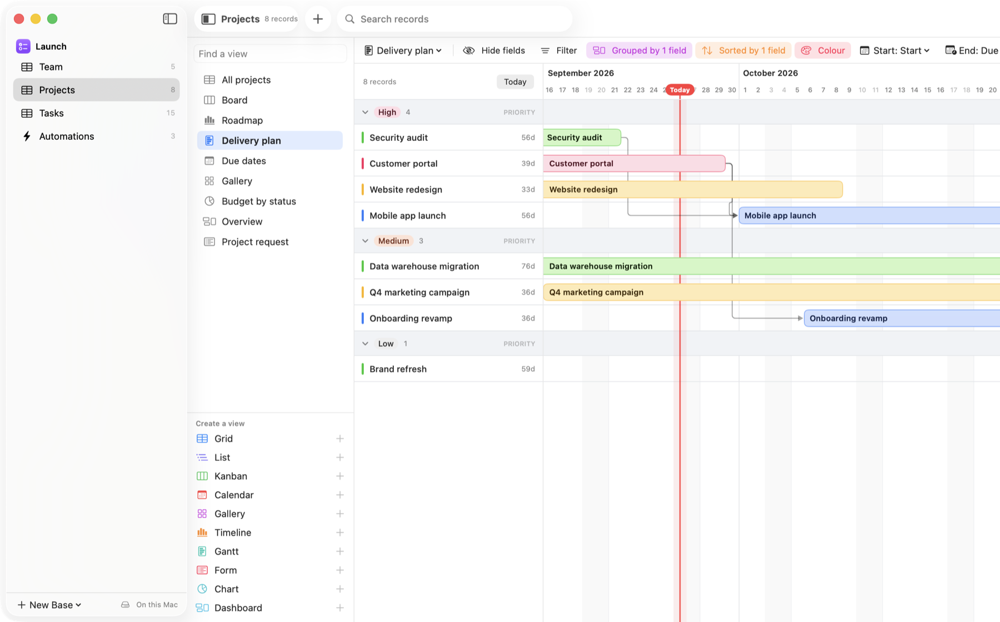
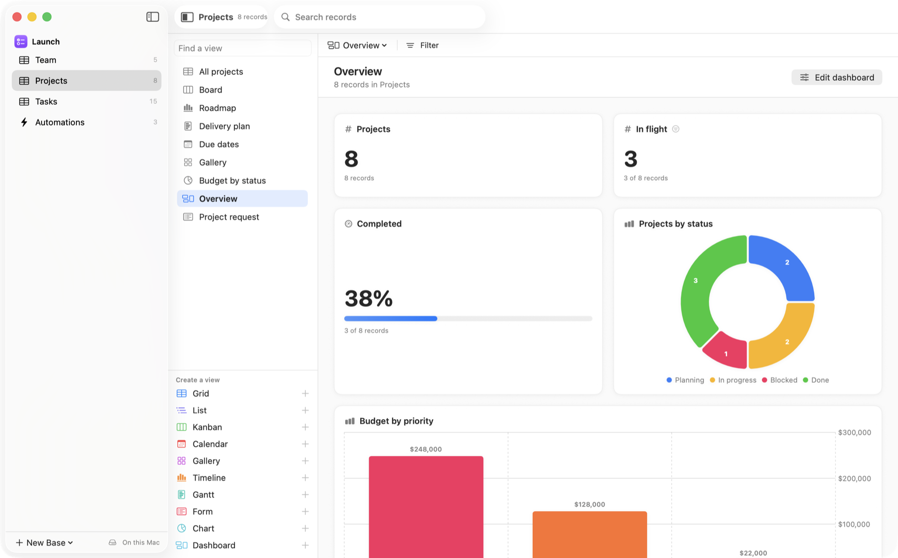
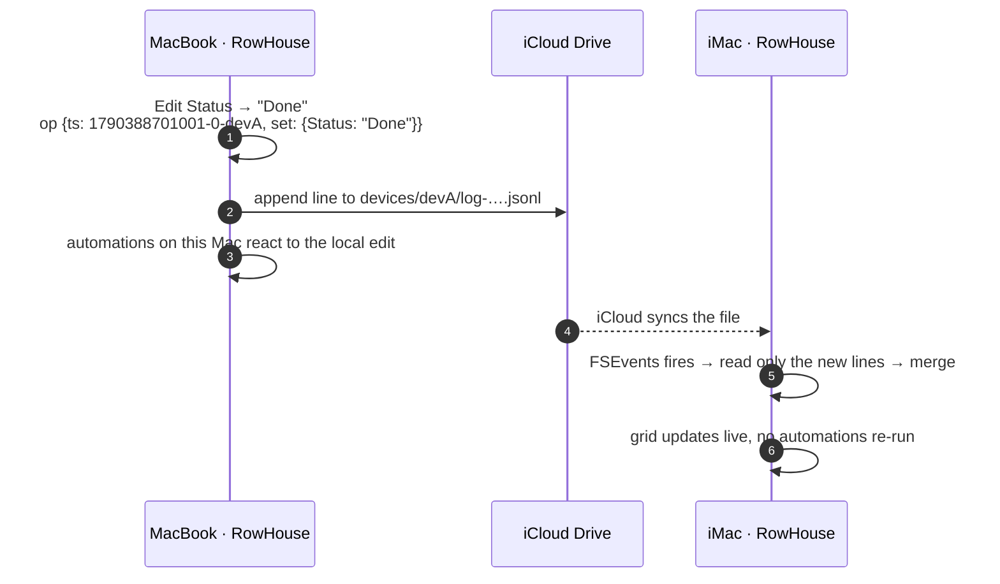
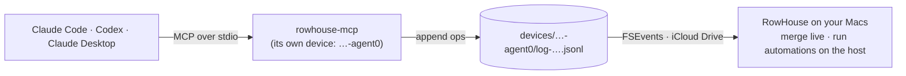

<p align="center">
  
</p>

<h1 align="center">RowHouse</h1>

<p align="center">
  <strong>A native Mac database with views, formulas and automations. Like Airtable, but your data lives in your own iCloud Drive.</strong>
</p>

<p align="center">
  <a href="https://github.com/REllwood/RowHouse/releases/latest"></a>
  <a href="https://github.com/REllwood/RowHouse/actions/workflows/ci.yml"></a>
  
  
  <a href="LICENSE"></a>
</p>

<p align="center">
  <a href="https://github.com/REllwood/RowHouse/releases/latest"><b>Download for Mac</b></a> ·
  <a href="https://rellwood.github.io/RowHouse/">Website</a> ·
  <a href="#how-it-works">How it works</a> ·
  <a href="#ai-assistants-mcp">AI assistants (MCP)</a> ·
  <a href="#automations">Automations</a> ·
  <a href="#compared-with-airtable">Compared with Airtable</a>
</p>

<picture>
  <source media="(prefers-color-scheme: dark)" srcset=".github/assets/hero-dark.png">
  
</picture>

RowHouse is a self-hosted, local-first alternative to Airtable for the Mac. You build bases out of tables, fields and linked records, and look at them as grids, lists, kanban boards, calendars, galleries, timelines, Gantt charts, forms, charts and dashboards. Automations run when records change, when forms are submitted, when buttons are clicked, when a webhook arrives or on a schedule.

AI assistants such as **Claude** and **Codex** can work with your bases too: RowHouse ships with an [MCP server](#ai-assistants-mcp), so you can ask an assistant to look things up, fill in records or build out a whole table.

There's no server and no account. Each base is a folder of plain files in **iCloud Drive › RowHouse**. Every Mac you use writes its own change log and merges the others, so your bases stay in sync, even when you edit on two Macs at once or while offline.

<p align="center">
  
</p>

## Contents

- [Features](#features)
- [Install](#install)
- [How it works](#how-it-works)
- [AI assistants (MCP)](#ai-assistants-mcp)
- [Automations](#automations)
- [Formulas](#formulas)
- [Keyboard shortcuts](#keyboard-shortcuts)
- [Importing and exporting](#importing-and-exporting)
- [Compared with Airtable](#compared-with-airtable)
- [Building from source](#building-from-source)
- [FAQ](#faq)

## Features

| | |
|---|---|
| **10 view types** | Grid, List (records nested under linked records), Kanban, Calendar (month or week), Gallery, Timeline, Gantt (with dependencies), Form, Chart and Dashboard. Each view has its own filters, sorts, grouping, hidden fields, colours, row height, summaries and column widths, and can be locked. |
| **29 field types** | Text, long text (with rich text), email, URL, phone, number, currency, percent, duration, rating, checkbox, single and multiple select, date, attachment, link to another record, lookup, rollup, count, formula, created time, last modified time, created by, last modified by, autonumber, button, collaborator, barcode and AI. |
| **AI assistants** | A built-in MCP server lets Claude Code, Codex, Claude Desktop and other MCP clients read, search, create and update records and build tables and fields. |
| **AI fields** | Write a prompt that refers to other fields and Claude fills in the value for every record, using your own Anthropic API key. |
| **Linked records** | Two-way relationships between tables, with lookups, rollups and counts that update as you type and can be limited to linked records that match conditions. |
| **Formulas** | 84 Airtable-compatible functions for text, numbers, dates, arrays and regular expressions, with live validation and a built-in reference. |
| **Automations** | 9 triggers and 11 actions, including webhooks in and out, email, JavaScript, Apple Shortcuts, Generate text with AI and repeat-for-each-item steps. |
| **Spreadsheet feel** | Keyboard navigation, type-to-edit, range selection, copy and paste to and from Numbers or Excel, fill down, drag to reorder, undo and redo. |
| **Collaboration** | Comments with @mentions and notifications, collaborator fields, a "current user" filter, record history showing who changed what, and a trash for everything you delete. |
| **Tools** | Record templates, base-wide search, find and replace, find and merge duplicates, print and PDF, backups and duplicate base. |
| **Forms** | Build a form from any table, with required fields and fields that only show when conditions are met. Submissions create records and can start automations. |
| **Sync without a server** | Works in iCloud Drive, any synced folder, or on one Mac. Conflicts are resolved field by field, deterministically, on every device. |
| **Import** | CSV and Excel (with field type detection) and whole bases straight from Airtable using a personal access token. |
| **Templates** | Project Tracker, Sales CRM, Content Calendar and Inventory, each with sample data, views, a dashboard and working automations. |

<p align="center">
  
</p>

<picture>
  <source media="(prefers-color-scheme: dark)" srcset=".github/assets/gantt-dark.png">
  
</picture>

<picture>
  <source media="(prefers-color-scheme: dark)" srcset=".github/assets/dashboard-dark.png">
  
</picture>

<p align="center">
  
  
</p>

## Install

1. Download **RowHouse-x.y.z.dmg** from the [latest release](https://github.com/REllwood/RowHouse/releases/latest).
2. Open it and drag **RowHouse** into **Applications**.
3. Open RowHouse and choose a template, or import a CSV or an Airtable base.

RowHouse needs **macOS 14 Sonoma or later** and runs natively on Apple silicon and Intel Macs. Releases are signed with a Developer ID. If macOS says it can't verify the app the first time you open it, go to **System Settings › Privacy & Security** and click **Open Anyway**.

To sync between Macs, turn on iCloud Drive on each one. RowHouse saves bases to **iCloud Drive › RowHouse** automatically. If you'd rather not use iCloud Drive, choose **On this Mac only** or any folder in **Settings › Storage**. A Dropbox or Syncthing folder works too.

## How it works

<p align="center">
  
</p>

The map above is RowHouse's own source code, drawn with [graphify](https://github.com/Graphify-Labs/graphify). Each dot is a type, function or file, and each line is a call or reference between them. The dots settle into islands for the parts of the app, and then the path of a single edit lights up across them:

1. You edit a record in the grid or another view.
2. `BaseDocument` applies the change and records undo.
3. Formulas, lookups and rollups recompute.
4. The change is appended to this Mac's own log, stamped with a hybrid logical clock.
5. iCloud Drive syncs the log, and every other Mac merges it field by field.
6. Automations run once, on the Mac where the change was made.
7. Claude and Codex edit through the MCP server, as a device of their own.

The code is four Swift modules: a formula engine (`RowHouseFormula`), a core library with no UI (`RowHouseCore`), the MCP server (`RowHouseMCPKit`) and the Mac app.

### Plain files, one writer each

A base is a folder you can see in Finder:

```
Project Tracker.rowhouse/
├── manifest.json                     written once, when the base is created
├── attachments/
│   └── 3f7a…c91e.jpg                 files, named by the SHA-256 of their contents
└── devices/
    ├── dev7f3a91c2e44b/              one folder per Mac, and only that Mac writes to it
    │   ├── log-1790388701001-8B5022.jsonl   append-only change log
    │   ├── snapshot.json             that Mac's merged state + the log segments it covers
    │   └── runs.jsonl                automation run history
    └── dev2b8c41d09e7a/
        └── …
```

Every edit becomes a small operation, `{ timestamp, entity, id, properties }`, that is appended to this Mac's log. Because each file has exactly one writer, iCloud Drive never has to resolve a conflict or create a "conflicted copy".

### Merging

Every property of every table, field, view, record and automation is a *last-writer-wins register* stamped with a [hybrid logical clock](https://cse.buffalo.edu/tech-reports/2014-04.pdf). An HLC is wall-clock time plus a counter plus the device id, so timestamps are unique and totally ordered even when Macs' clocks disagree. Merging is commutative, associative and idempotent. Any Mac that has seen the same set of operations ends up with identical state, no matter what order they arrived in or how many times.

- Two people editing different fields of the same record both keep their changes.
- Two people editing the same field: the later edit wins, the same way on every Mac.
- Deleting is a `_deleted` flag, so a delete and a concurrent edit resolve predictably.
- The inverse side of a link is computed from the owning side, so two-way links can never disagree.



<p align="center">
  
</p>

Each Mac also writes a snapshot of its merged state now and then. Opening a base loads the snapshots and replays only the log lines written after them, which keeps launch fast. Old log segments are deleted two weeks after a newer snapshot covers them, which is also how far back record history goes. Files that "Optimise Mac Storage" has evicted are downloaded on demand.

### Automations run exactly once

With several Macs sharing a base, the same trigger must not fire on each of them:

- **Record triggers** (created, updated, matches conditions, enters view) fire only on the Mac where the change was made. Edits that arrive from another Mac are merged but never trigger anything there.
- **Edits made by AI assistants** through the MCP server fire record triggers on the base's *automation host*, since nobody is at a keyboard where they were made.
- **Scheduled triggers** fire only on the automation host, the Mac chosen in **Settings › Automations** (or, if none is chosen, the same Mac on every device).
- **Webhooks** run on the Mac that received them.
- Chains of automations stop after 5 levels, and each automation is limited to 60 runs a minute.

## AI assistants (MCP)

RowHouse includes `rowhouse-mcp`, a [Model Context Protocol](https://modelcontextprotocol.io) server inside the app bundle. Connect it to an AI assistant and you can ask things like *"add these five leads to the CRM"*, *"which projects are overdue?"* or *"make a table for our reading list with an author, a rating and a status"*.

**Claude Code**

```bash
claude mcp add --scope user rowhouse -- /Applications/RowHouse.app/Contents/MacOS/rowhouse-mcp
```

**Codex** (`~/.codex/config.toml`)

```toml
[mcp_servers.rowhouse]
command = "/Applications/RowHouse.app/Contents/MacOS/rowhouse-mcp"
```

**Claude Desktop** (Settings › Developer › Edit Config, then restart Claude)

```json
{
  "mcpServers": {
    "rowhouse": {
      "command": "/Applications/RowHouse.app/Contents/MacOS/rowhouse-mcp"
    }
  }
}
```

**Settings › AI Assistants** in RowHouse shows the same snippets with the right path for your copy of the app, ready to copy.

| Tool | What it does |
|---|---|
| `list_bases`, `get_base_schema` | Bases, tables, fields (with types and options) and views |
| `list_records`, `get_record`, `search_records` | Read records, with views, Airtable-style `filter_formula`, sorting, paging and base-wide search |
| `create_records`, `update_records`, `delete_records` | Up to 100 records per call, validated before anything is written; `typecast` adds missing select options and collaborators |
| `create_table`, `update_table`, `create_field`, `update_field` | Build and change the schema, including links, lookups, rollups, formulas and AI fields |
| `list_comments`, `add_comment` | Read and write record comments |
| `create_base`, `describe_field_types` | Start a base from a template, and learn every field type's JSON format |

Tables, fields and records can be named instead of using ids. Values use the same JSON shapes as Airtable's REST API.



The server writes to your bases the same way another Mac does: into its own change log, as its own device. Its edits show up in the app within a second, sync to your other Macs, and appear in record history as "Claude Code (MCP)" or "Codex (MCP)". Record automations run for them on the base's automation host. Two assistants running at once each get their own device folder, so they never write to the same file.

If your bases are in iCloud Drive and the assistant can't see them, allow the app that runs it (Terminal, your editor, Claude or Codex) to access iCloud Drive in **System Settings › Privacy & Security › Files & Folders**.

### AI fields and actions

Add your Anthropic API key in **Settings › Claude AI** (it's kept in your Keychain), then:

- **AI field**: write a prompt such as `Summarise {Notes} in one sentence for {Client}`. Generate a single cell from the record, or every empty cell in a view from the column menu.
- **Generate text with AI** automation action: its output is available to later steps as `{{steps.N.text}}`, for example to fill in a field or write an email.

Prompts and the field values they mention are sent to Anthropic's API only when you generate. Claude Opus 5 is the default; Sonnet 5 and Haiku 4.5 can be chosen per field or per step.

## Automations

<p align="center">
  
</p>

| Triggers | Actions |
|---|---|
| When a record is created | Create record |
| When a record is updated (optionally only for chosen fields) | Update record |
| When a record matches conditions | Delete record |
| When a record enters a view | Find records |
| When a form is submitted | Send Mac notification |
| At a scheduled time (every few minutes, hourly, daily, weekly, monthly) | Send email (through Mail) |
| When a button is clicked | Send HTTP request (webhooks, APIs) |
| When a webhook is received | Run JavaScript |
| When run manually | Run an Apple Shortcut |
| | Generate text with AI |

Any step can have its own conditions, such as "only if Status is Blocked", and can **repeat for each item** of an earlier step's list, for example once for every record that Find records returned. Every run is recorded with per-step results and logs, and you can see runs from all your Macs in **Run history**.

**Incoming webhooks** are off until you turn them on in **Settings › Webhooks**. Each webhook automation gets its own URL with a secret token, such as `http://127.0.0.1:8738/hooks/aut…/Qk7…`. The server only listens on this Mac, so other software on the Mac (or a tunnel you set up) can call it; the request's JSON, form fields and query string are available as `{{trigger.body.…}}` and `{{trigger.query.…}}`.

### Values from earlier steps

Text in any action can include placeholders:

| Placeholder | Value |
|---|---|
| `{{trigger.record.Name}}` | A field of the trigger record, by name |
| `{{trigger.record.id}}`, `{{trigger.record.url}}` | Record id and a `rowhouse://` link that opens it |
| `{{steps.2.count}}`, `{{steps.2.titles}}` | Output of step 2 (for example, Find records) |
| `{{steps.3.status}}`, `{{steps.3.json.id}}` | Status and parsed JSON from an HTTP request |
| `{{steps.4.text}}` | Text written by a Generate text with AI step |
| `{{item.Name}}`, `{{index}}` | The current item in a step that repeats for each item |
| `{{now}}`, `{{today}}` | Current date and time |

Add `| json` to insert a value safely inside a JSON body, or `| url` for a query string: `{"name": {{trigger.record.Name | json}}}`.

### Scripts

Scripts use a subset of Airtable's scripting API, so many existing scripts work unchanged:

```js
const { recordId } = input.config();
const table = base.getTable("Projects");
const query = await table.selectRecordsAsync();

let open = 0;
for (const record of query.records) {
  if (record.getCellValueAsString("Status") !== "Done") open++;
}

await table.updateRecordAsync(recordId, { "Notes": `There are ${open} open projects` });
const response = await fetch("https://api.example.com/stats", { method: "POST", body: JSON.stringify({ open }) });
output.set("open", open);
```

Supported: `base.getTable`, `table.selectRecordsAsync({ sorts })`, `record.getCellValue`, `record.getCellValueAsString`, `table.createRecordAsync`, `createRecordsAsync`, `updateRecordAsync`, `updateRecordsAsync`, `deleteRecordAsync`, `deleteRecordsAsync`, `fetch` / `remoteFetchAsync`, `input.config()`, `output.set`, and `console.log`. Scripts time out after 30 seconds.

## Formulas

Formula fields use Airtable's syntax: `{Field Name}` references, `&` to join text, and the usual operators. References are stored by field id, so renaming a field never breaks a formula.

```
IF({Status} = "Done", "✅ Done",
  IF(AND({Due}, IS_BEFORE({Due}, TODAY())), "🔴 Overdue",
    DATETIME_DIFF({Due}, TODAY(), 'days') & " days left"))
```

| Category | Functions |
|---|---|
| Logical | `AND` `BLANK` `ERROR` `FALSE` `IF` `ISERROR` `NOT` `OR` `SWITCH` `TRUE` `XOR` |
| Text | `CONCATENATE` `ENCODE_URL_COMPONENT` `FIND` `LEFT` `LEN` `LOWER` `MID` `REPLACE` `REPT` `RIGHT` `SEARCH` `SUBSTITUTE` `T` `TRIM` `UPPER` |
| Regex | `REGEX_EXTRACT` `REGEX_MATCH` `REGEX_REPLACE` |
| Numeric | `ABS` `AVERAGE` `CEILING` `COUNT` `COUNTA` `COUNTALL` `EVEN` `EXP` `FLOOR` `INT` `LOG` `MAX` `MIN` `MOD` `ODD` `POWER` `ROUND` `ROUNDDOWN` `ROUNDUP` `SQRT` `SUM` `VALUE` |
| Date | `DATEADD` `DATESTR` `DATETIME_DIFF` `DATETIME_FORMAT` `DATETIME_PARSE` `DAY` `FROMNOW` `HOUR` `IS_AFTER` `IS_BEFORE` `IS_SAME` `MINUTE` `MONTH` `NOW` `SECOND` `SET_LOCALE` `SET_TIMEZONE` `TIMESTR` `TODAY` `TONOW` `WEEKDAY` `WEEKNUM` `WORKDAY` `WORKDAY_DIFF` `YEAR` |
| Array | `ARRAYCOMPACT` `ARRAYFLATTEN` `ARRAYJOIN` `ARRAYSLICE` `ARRAYUNIQUE` |
| Record | `CREATED_TIME` `LAST_MODIFIED_TIME` `RECORD_ID` |

Rollups use the same engine with a `values` variable, for example `SUM(values)`, `ARRAYJOIN(ARRAYUNIQUE(values))` or `MAX(values) - MIN(values)`.

## Keyboard shortcuts

| Keys | Action |
|---|---|
| Arrow keys, Tab, ⇧Tab | Move between cells |
| ⇧ + arrows or drag | Select a range |
| ⌘ + arrows | Jump to the first or last row or column |
| Return, or start typing | Edit the cell |
| ⇧Return | Add a record below |
| Space | Expand the record |
| Delete | Clear cells, or delete the selected rows |
| ⌘C / ⌘X / ⌘V | Copy, cut and paste (tab-separated, works with Numbers, Excel and Sheets) |
| ⌘D | Fill down |
| ⌘Z / ⇧⌘Z | Undo and redo |
| ⌘F · ⇧⌘F · ⌥⌘F | Search this view · search the whole base · find and replace |
| ⇧⌘N · ⌥⌘T · ⌥⌘N | New base · new table · new field |
| ⇧⌘I · ⇧⌘E · ⌘P | Import a spreadsheet · export the view as CSV · print the view |
| ⌘/ | Show all keyboard shortcuts |

## Importing and exporting

- **CSV and Excel import** detects numbers, currency, percentages, dates, checkboxes, emails, URLs and select options. Pick a worksheet from an `.xlsx` workbook. You can create a new base or table, or add rows to an existing table and map columns to fields.
- **Import from Airtable** copies a whole base: tables, field types, select options, linked records, lookups, rollups, formulas and attachments. You'll need a [personal access token](https://airtable.com/create/tokens) with the `schema.bases:read` and `data.records:read` scopes. The token is only kept in memory while the import runs.
- **CSV export** saves any view, including only its visible fields and filtered records.
- **Print and PDF**: ⌘P prints the current view as a table (with its groups and summaries); a record's ⋯ menu prints the record with its comments. Choose **Save as PDF** in the print dialog for a PDF.
- **Backups**: **Export Backup…** in a base's menu saves the whole base, attachments included, as a zip; **Restore Backup…** at the bottom of the sidebar brings it back as a new base.
- **Deep links:** `rowhouse://record?base=…&table=…&record=…` opens a record from anywhere, such as a notification, a Shortcut or another app. `rowhouse://form?base=…&view=…&Name=Ada` opens a form with fields filled in.

## Compared with Airtable

RowHouse covers the parts of Airtable you use day to day. What's left out is mostly what needs Airtable's servers.

| Airtable | RowHouse |
|---|---|
| Bases, tables, linked records, lookups, rollups, counts | ✅ Including rollups and lookups limited to linked records that match conditions |
| All field types, including user, created by, last modified by, barcode, button, rich text and AI | ✅ 29 field types. "User" is a collaborator from the base's list of people, since there are no accounts |
| Grid, list, kanban, calendar, gallery, timeline, Gantt and form views | ✅ All of them, with filters, sorts, grouping, colours (by field or conditions), summaries, row height and locked views |
| Interfaces | 🟡 Dashboard views with numbers, charts, record lists and progress. There's no page designer for full custom interfaces |
| Formulas | ✅ 84 functions with Airtable's syntax |
| Automations | ✅ 9 triggers and 11 actions, conditions, repeating steps, run history. Slack, Google and other integrations go through HTTP requests, webhooks or Apple Shortcuts |
| Scripting | ✅ Airtable's scripting API in automations and in **Run Script…** |
| Extensions | ✅ Dedupe (Find Duplicates), page designer (Print Record), chart, scripting. No marketplace |
| Record templates, comments, @mentions, revision history, trash, snapshots | ✅ History and trash go back two weeks; snapshots are backups you export |
| Search, find and replace, import from CSV, Excel and Airtable | ✅ |
| Airtable AI | ✅ AI fields and a Generate text with AI action, with your own Anthropic API key |
| Web API | 🟡 An MCP server for AI assistants, scripts, webhooks and `rowhouse://` links instead of a hosted REST API |
| Sharing, permissions, shared view links and embeds | ❌ There's no server. Share a base by sharing its iCloud Drive folder; everyone who can open it can edit it |
| Synced tables between bases, mobile and web apps | ❌ Not yet. RowHouse is a Mac app |

## Building from source

You need Xcode 16 or later.

```bash
git clone https://github.com/REllwood/RowHouse.git
cd RowHouse
swift test                      # 372 tests: formulas, sync, queries, views, automations, scripts, AI, MCP, importers
CONFIG=debug scripts/build-app.sh
open .build/app/RowHouse.app
```

`scripts/release.sh` builds a universal, signed DMG and zip into `.build/release-artifacts/`. Set `SIGN_IDENTITY` to a Developer ID identity and `NOTARY_PROFILE` to a `notarytool` keychain profile to sign and notarise. For development, `ROWHOUSE_LIBRARY_PATH` points the app at a different folder, and `ROWHOUSE_DEVICE_ID` lets you simulate a second Mac.

| Module | What's in it |
|---|---|
| `Sources/RowHouseFormula` | Lexer, parser, evaluator and date formatting for formulas. Foundation only. |
| `Sources/RowHouseCore` | Data model, sync, storage, computed fields, queries, automations, scripting, AI, CSV, Excel and Airtable import, templates. No UI. |
| `Sources/RowHouseMCPKit`, `Sources/rowhouse-mcp` | The MCP server that AI assistants talk to. It's built into `RowHouse.app/Contents/MacOS/`. |
| `Sources/RowHouse` | The SwiftUI + AppKit app. The grid is a custom-drawn `NSTableView` that stays smooth with tens of thousands of rows. |

## FAQ

**Is RowHouse affiliated with Airtable?**
No. RowHouse is an independent open-source project. Airtable is a trademark of Formagrid, Inc.

**Where exactly is my data?**
In `~/Library/Mobile Documents/com~apple~CloudDocs/RowHouse`, which is iCloud Drive › RowHouse in Finder, unless you chose another folder. RowHouse never uploads your data anywhere else on its own. The only requests it makes are an optional daily update check against GitHub Releases, whatever your automations do, and, when you generate AI values with your own API key, the prompt and the fields it mentions going to Anthropic.

**What can an AI assistant see?**
Only what you ask it to look at, through the MCP server's tools, and only while you've connected it. The assistant's app (Claude Code, Codex or Claude Desktop) sends what it reads to its model provider, the same as anything else you show it.

**Can several people share a base?**
Anyone who can open the folder can use the base, so a shared iCloud Drive folder works. There are no per-user permissions. RowHouse is designed for you and your devices, or a small trusted team.

**What happens if two Macs edit while offline?**
Both keep working. When they reconnect, every edit is merged field by field, and both Macs end up with the same result.

**Does it run on iPhone or iPad?**
Not yet. The core library has no UI code, so an iOS app is possible.

## License

MIT © Rhys Ellwood. See [LICENSE](LICENSE).
